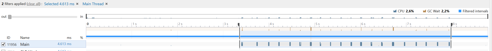
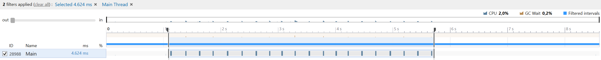
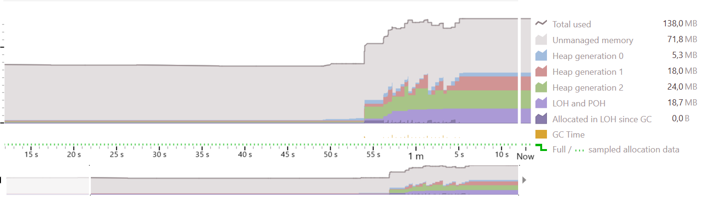
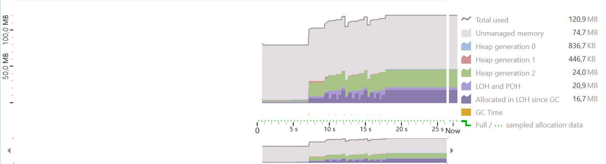
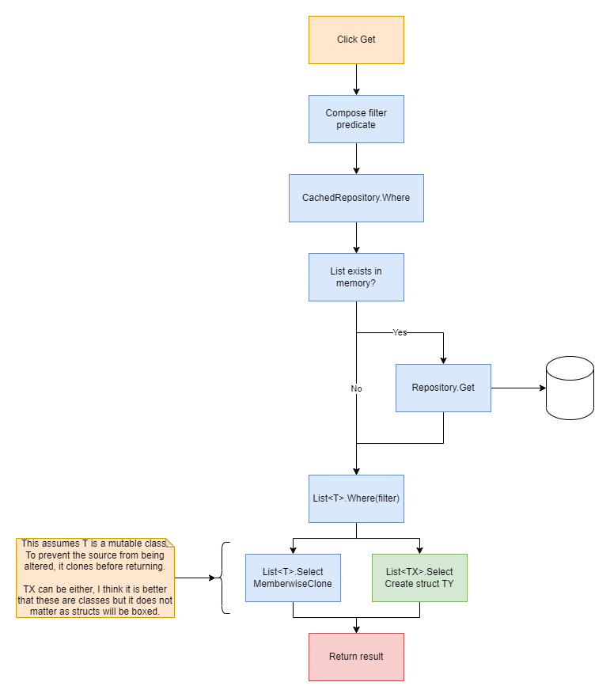

# MemoryCacheLayer

A design I've made to give myself an example I can reuse to add caching to an existing single instance application.
The CachingFramework project is for multiple instances using the same dataset.

# Experiment

During the creation of this library I came across something I did not know: What impact does mass construction of objects have? Will it indefinitly increase memory usage untill GC comes and pick them up, how long does GC take before it picks them up, and does it differ much to use structs instead?

I know that objects live on the heap and structs live on the stack which means that objects by design are meant for a long(er) live span compared to a struct. As structs are discarded when leaving the scope. But also... since structs live on the stack and unless boxed, are continuesly duplicated when passing to a different scope.

First I went in and just did a simple check with a stopwatch and checking process.PrivateMemorySize64 to see what was happening when instantiating 100,000 classes everytime I clicked a button.

The following is a snapshot of 10 clicks:

| Clicks       | 1         | 2         | 3         | 4         | 5         | 6         | 7         | 8         | 3         | 3         |
|:-------------|:----------|:----------|:----------|:----------|:----------|:----------|:----------|:----------|:----------|:----------|
| Time elapsed | 0.019 s   | 0.027 s   | 0.037 s   | 0.017 s   | 0.017 s   | 0.030 s   | 0.018 s   | 0.018 s   | 0.017 s   | 0.028 s   |
| Memory used  | 112,18 mb | 121,04 mb | 112,18 mb | 132,21 mb | 132,21 mb | 138,65 mb | 136,54 mb | 141,29 mb | 132,66 mb | 146,63 mb |

When continuesly clicking, these numbers wobble between:
0.015s and 0.040s
110 and 150mb

Having learned this, I wished to know what the difference would be if I instead instantiated 100,000 structs everytime I clicked a button.

The following is a snapshot of 10 clicks:

| Clicks       | 1         | 2         | 3         | 4         | 5         | 6         | 7         | 8         | 3         | 3         |
|:-------------|:----------|:----------|:----------|:----------|:----------|:----------|:----------|:----------|:----------|:----------|
| Time elapsed | 0.015 s   | 0.014 s   | 0.015 s   | 0.016 s   | 0.017 s   | 0.015 s   | 0.014 s   | 0.015 s   | 0.016 s   | 0.016 s   |
| Memory used  | 110,22 mb | 109,17 mb | 103,56 mb | 109,71 mb | 112,21 mb | 112,27 mb | 111,18 mb | 103,32 mb | 108,85 mb | 111,34 mb |

When continuesly clicking, these numbers wobble between:
0.013s and 0.017s
100 and 115mb

So not only is the response time much more stable, memory usage is more stable.

This then made me curious if I could see more about what is going on, using JetBrains's DotTrace and DotMemory I gained the following insights:

| Object CPU |
| --- |
|  |

| Struct CPU |
| --- |
|  |

| Object Memory | Struct Memory |
| --- | --- |
|  |  |

So what I find interesting about this is that the code I created for the structs is a bit more complex, using more indirection and generics. It still stashes a list of objects in memory and everytime I click a button it gets that list (reference to it) and then iterates over it to return a list of structs that "represent" that same list.

This feels like the struct approach would have more impact, but now I think that feeling was misplaced and .net knows how to deal with it efficiently.

As structs lock the thread a lot less often in this situation (0.2% compared to 2%) and need slightly less cpu to be managed by .net.

Mock up of the design of the library:

